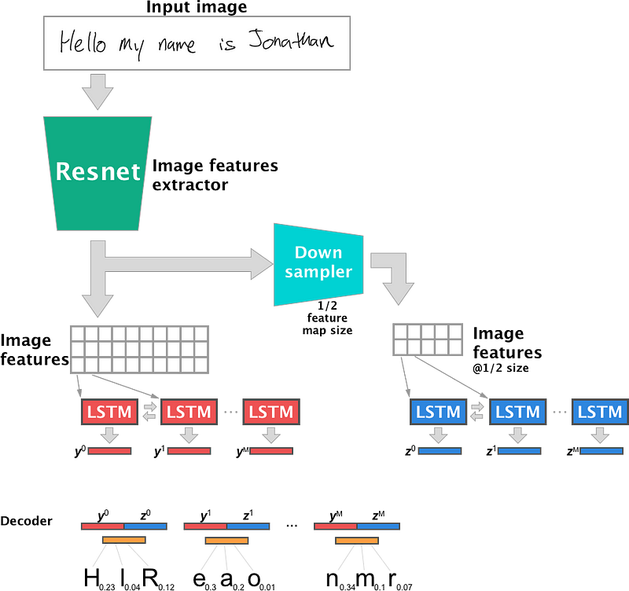

# MedScribe
MedScribe is an advanced Optical Character Recognition (OCR) system designed specifically for digitizing medical documents. The project integrates a React frontend and a Python Flask backend to process PDFs and images, extract text using an OCR pipeline, and return the extracted data to the frontend in a user-friendly interface.

## Table of Contents
1. [Overview](#overview)
2. [Features](#features)
3. [Installation and Setup](#installation-and-setup)
4. [Usage](#usage)
5. [Project Structure](#project-structure)
6. [Technical Report:](#technical-report)
    - [Abstract](#abstract)
    - [Introduction](#introduction)
    - [Methodology](#methodology)
    - [Results](#results)
    - [Demo](#demo)
    - [Conclusion](#conclusion)
   

## Overview
MedScribe enables users to upload medical documents, process them using an OCR engine, and extract textual data from PDFs or images. The platform supports multiple document types and is designed for healthcare professionals and individuals who need to digitize medical records and reports.

## Features
- File Upload: Users can upload PDFs and images (JPG, PNG) from the frontend.
- PDF to Image Conversion: For PDF files, each page is converted to an image before applying OCR.
- OCR Processing: Extract texts from both typed and handwritten images
- Masked Region Handling: Masks irrelevant sections of documents (like bounding boxes) for accurate OCR results.
- Full Stack Implementation: React for frontend, Flask for backend, and Python libraries for image processing and OCR.
- JSON Output: The extracted text is returned as JSON and displayed on the frontend.

## Installation and Setup

### Prerequisites

    Python 3.8+
    Node.js (with npm)
    
### Setup
- Clone the repository:
```
git clone https://github.com/Shazam213/MedScribe.git
cd Medscribe
```
- Install Python dependencies:
```
pip install -r requirements.txt
```
- You would need to download the model parameters:
Link to download
After downloading place all the files inside the __/backend/models__ directory.
- Backend Setup
```
cd backend
python app.py
```
- Frontend Setup
```
cd ../frontend
npm install
npm start
```

## Usage
1. Navigate to the React frontend:

    Open http://localhost:3000 in your browser.

2. Upload a file:

    Use the file input to upload a PDF or image document (e.g., JPG, PNG).

3. Process the document:

    The document will be sent to the backend, where it will be processed, and the extracted text will be returned and displayed on the frontend.

4. Receive OCR results:

    The extracted text is displayed in a text box, with options to download or copy the text as needed.

## Project Structure

    .
        └── automated-preferential-looking/
            ├── backend
            |   ├── models/
            |   ├── ocr/
            |   ├── pycache
            |   ├── output/
            |   ├── test/
            |   ├── uploads/
            |   ├── app.py
            |   ├── handwritten_ocr.py
            |   ├── main_ocr.py
            |   ├── preprocessing.py
            |   ├── segment_handwritten_text.py
            |   ├── typed_ocr.py
            ├──frontend
            |   ├── node_modules/
            |   ├── public/
            |   ├──src/
            ├── LICENSE
            ├── README.md
            └── requirements.txt

# Technical Report

## Abstract
MedScribe provides an efficient method for digitizing medical documents through OCR. The system uses a hybrid approach for text extraction of handwritten and typed text, and a full-stack interface built with React and Flask for user interaction. This project aims to streamline document digitization for healthcare professionals by automating the text extraction process.

## Introduction

The healthcare industry heavily depends on physical records, making the digitization of these documents crucial for enhancing workflow efficiency and ensuring quick access to patient information. OCR technology, particularly in the medical field, offers significant opportunities for transforming printed materials into searchable and editable digital formats. MedScribe is designed to address this issue by providing a user-friendly platform for digitizing medical records.

A key challenge with traditional OCR solutions is their inability to accurately extract both typed and handwritten text from images simultaneously. Our goal is to overcome this limitation by employing a unique hybrid approach that delivers improved results and accuracy.

## Methodology

The entire pipeline can be broken down into four major steps:
### Preprocessing:
- File Handling: The system checks the file format (PDF or image). If it's a PDF, each page is converted into an image for OCR.
- Skew Correction: Use Hough Line Transform to correct any skewness in the image.

- Convert to Grayscale: Transform the corrected image into grayscale for easier processing.

- Noise Reduction: Apply fastNlMeansDenoising to minimize noise in the grayscale image.

- Contrast Adjustment: Enhance image contrast using histogram equalization.

- Adaptive Thresholding: Apply adaptive thresholding (or Otsu's thresholding) to create a binary image.

- Optional Resizing: Resize the image to optimize performance for OCR.

- Return Processed Image: Output the final processed image for OCR analysis.

### Segmentation:

This is the most crucial step where we segment the handwritten text from the typed text using CNNs. IAM Handwriting Dataset was used to train the model.

 

 ### Text Detection
In this step, we employ two distinct models for text detection:
- Handwritten Text Detection: The handwritten text is sent to a custom pre-trained model, specifically trained on the IAM Handwriting dataset, for accurate detection.

- Segmentation and Masking: After detecting the handwritten text, we mask the segmented areas of the original image.

- Typed Text Detection: The masked image is then processed using the Tesseract model to identify the typed text.

This approach enhances overall accuracy by effectively addressing both handwritten and typed text in the image.

Handwritten text detection model:


### Postprocessing

Finally, we apply various denoising techniques to the output text. Once the text is cleaned up, we send the processed output back to the frontend in JSON format, allowing for easy editing and further manipulation on the client side.

## Results:
- Original Picture:


- Preprocesssing:
  

- Segmentation:
  

- Masked Image:
  

- Final Result:
  


## Demo


## Conclusion

MedScribe successfully digitizes medical records by extracting text from PDFs and images using a combination of Tesseract-OCR and custom trained model. This system offers significant advantages for medical professionals looking to digitize their workflow. Future work will focus on improving accuracy for handwritten notes and more complex document types.

